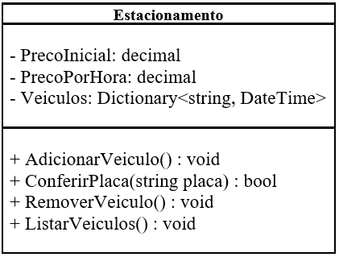

# DIO - Trilha .NET - Fundamentos
www.dio.me

## Desafio de projeto
Para este desafio, você precisará usar seus conhecimentos adquiridos no módulo de fundamentos, da trilha .NET da DIO.

## Contexto
Você foi contratado para construir um sistema para um estacionamento, que será usado para gerenciar os veículos estacionados e realizar suas operações, como por exemplo adicionar um veículo, remover um veículo (e exibir o valor cobrado durante o período) e listar os veículos.

## Proposta
Você precisará construir uma classe chamada "Estacionamento", conforme o diagrama abaixo:

A classe contém três variáveis, sendo:

**precoInicial**: Tipo decimal. É o preço cobrado para deixar seu veículo estacionado.

**precoPorHora**: Tipo decimal. É o preço por hora que o veículo permanecer estacionado.

**veiculos**: É uma lista de string, representando uma coleção de veículos estacionados. Contém apenas a placa do veículo.

A classe contém três métodos, sendo:

**AdicionarVeiculo**: Método responsável por receber uma placa digitada pelo usuário e guardar na variável **veiculos**.

**RemoverVeiculo**: Método responsável por verificar se um determinado veículo está estacionado, e caso positivo, irá pedir a quantidade de horas que ele permaneceu no estacionamento. Após isso, realiza o seguinte cálculo: **precoInicial** * **precoPorHora**, exibindo para o usuário.

**ListarVeiculos**: Lista todos os veículos presentes atualmente no estacionamento. Caso não haja nenhum, exibir a mensagem "Não há veículos estacionados".

Por último, deverá ser feito um menu interativo com as seguintes ações implementadas:
1. Cadastrar veículo
2. Remover veículo
3. Listar veículos
4. Encerrar

## Solução
O código está pela metade, e você deverá dar continuidade obedecendo as regras descritas acima, para que no final, tenhamos um programa funcional. Procure pela palavra comentada "TODO" no código, em seguida, implemente conforme as regras acima.

## Resolução
Inicialmente (primeiro commit), realizei tudo o que foi pedido no desafio, posteriormente o modifiquei e adicionei novas funcionalidades e verificações, como:

 - ### Adição do método ConferirPlaca
Uma novidade foi a criação do método **ConferirPlaca**, utilizei regex para identificar o padrão antigo (AAA-1111) e novo (AAA1A11) das placas, esse método verifica se está compatível com algum desses padrões, retornando um boolean. Ele é invocado no cadastro de novos veículos, através do método AdicionarVeiculo.

 - ### Alteração do nome dos atributos de camelCase para PascalCase.
O atributo precoInicial foi Renomeado para PrecoInicial, assim como precoPorHora e veiculos, sempre seguindo o recomendado, que nesse caso, é o PascalCase.

 - ### Alteração do tipo da variável Veiculos
No início, a variável veículo possuia um tipo List, com generics(<>) string, como eu desejava ao adicionar o veículo, também armazenar o horário que ele foi cadastrado, mudei seu tipo para Dictionary, que cria uma relação chave valor, onde a chave seria a placa, o valor, o horário de cadastro. Com isso, o generics (<>) ficou como string para o primeiro parâmetro e DateTime para o segundo.

 - ### Armazenamento do horário de cadastro
Com a modificação  da variável Veiculos, é possível realizar a conta de horas estacionado pela diferença entre o horário atual e o horário de armazenamento, dessa forma, temos duas opções de se trabalhar no método RemoverVeiculo, o qual o usuário pode escolher. Para a primeira diferença de horas, para ficar mais visual, cada minuto foi considerado como uma hora. 
Caso o usuário deseje inserir o tempo manualmente, será verificado se o valor não é negativo, caso seja, entra em loop até ser válido.

 - ### Substituição na forma de converter o Console.Readline()
Inicialmente, era utilizado o Convert, testando verifiquei que para valores inválidos, ocorriam muitas exceções, que alteravam o fluxo do código, e como não encontravam um tratamento, quebravam o código. Uma forma que encontrei para evitar essas exceções foi converter o tipo do Readline (string) utilizando o TryParse assim, se for possível, o valor da variável será atualizado, caso não, ele será mantido como está (normalmente, valendo zero).

 - ### Adição de lógica no construtor
Inicialmente, era possível adicionar valores negativos para os parâmetros precoInicial e precoPorHora, agora, caso alguns deles seja, entrará em loop até estar da forma correta (positivo).
 
 - ### Elaboração da documentação da classe
A classe foi totalmente documentada, de forma geral, seu construtor (incluindo os parâmetros) e todos os métodos (também incluindo seus parâmetros e retornos).

 - ### Atualização do diagrama de classe
O diagrama foi remodelado, ficando assim:
 

 
  - ### Criação de um vídeo mostrando as principais funcionalidades
Caso se interesse, você pode assistir esse vídeo, no qual testo o sistema!

Ou pode ser visto clicando nesse link: https://youtu.be/NmPXXaeOA1g

## Agradecimentos
Gostaria de agradecer muito a **Digital Innovation One** por ser uma empresa que sempre capacita muitos profissionais na área de programação, a **Pottencial** por criar essa oportunidade de bootcamp, ele está sensacional!

Também agradeço ao professor **Leonardo Buta**, sua didática é incrível, estou aprendendo muito com você!
  
